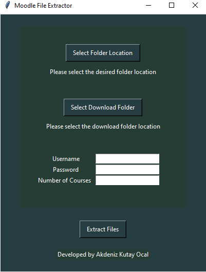
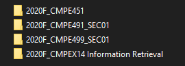

# Moodle File Extractor

### Design Purpose

&NewLine;

    This program is designed to extract the files that are uploaded to TEDUMoodle of all of courses that your are enrolled in a semester. The "Course Files" folder is created in the selected location and the related files are categorized under the course folders. Written in Python. Selenium and Tkinter are used.

### Requirements
    
&NewLine;

    - This application works on Chrome and its versions that are higher than 88.0.
    - Application is only tested on Windows and would not work on other operating systems.
    - In order the app to run faster you are suggested to clean the download folder.

### GUI

&NewLine;

&NewLine;

- Folder Location:    A path where the "Course Files" will be located into.
- Download Location:  A path where your system downloads the files from internet.
- Username-Password:  Login information used to enter the Tedu Moodle system.
- Number of Courses:  The number of courses you take in this semester. (Required in this version and will be removed later. Must be a Number between 1-N)

### Folder

&NewLine;

